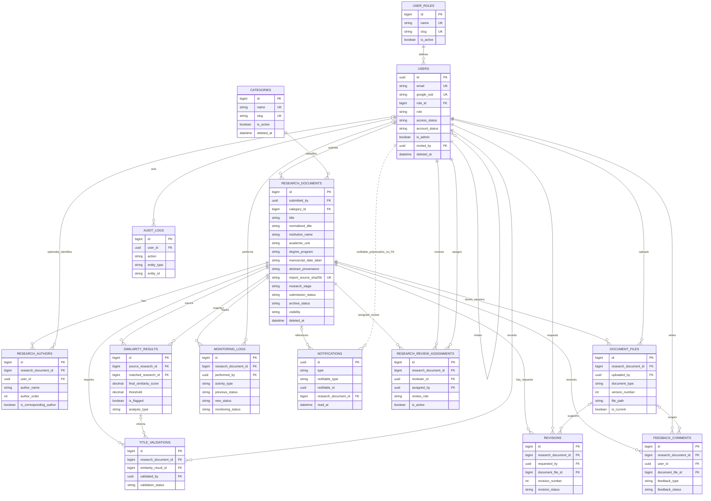

# ResearchNAV entity relationship diagram

## Eight major thesis entities

The thesis model contains exactly these eight major entities:

1. `USER_ROLES`
2. `USERS`
3. `RESEARCH_DOCUMENTS`
4. `SIMILARITY_RESULTS`
5. `FEEDBACK_COMMENTS`
6. `REVISIONS`
7. `NOTIFICATIONS`
8. `MONITORING_LOGS`

The diagram also shows the six supporting implementation tables required by the active Laravel services: `CATEGORIES`, `RESEARCH_AUTHORS`, `DOCUMENT_FILES`, `TITLE_VALIDATIONS`, `AUDIT_LOGS`, and `RESEARCH_REVIEW_ASSIGNMENTS`. Framework tables `SESSIONS` and `MIGRATIONS` are listed separately and are intentionally not in the application ERD.

## Supporting and framework tables

Supporting implementation tables:

- `CATEGORIES` classifies documents and is soft-deletable.
- `RESEARCH_AUTHORS` stores ordered author names and optionally links an author to a UUID user.
- `DOCUMENT_FILES` stores private file metadata. Versions are per document and `document_type`, begin at `1`, and use `is_current` to identify the current version.
- `TITLE_VALIDATIONS` stores explicit human decisions: `pending`, `approved`, `revision_required`, or `rejected`.
- `AUDIT_LOGS` stores immutable actor and action history. `entity_type` and `entity_id` are metadata, not foreign keys.
- `RESEARCH_REVIEW_ASSIGNMENTS` scopes adviser or instructor review by document. Its roles are `adviser` and `instructor`, and only active assignments authorize those reviewers.

Framework tables:

- `SESSIONS` stores Laravel database sessions. Its indexed `user_id` is not a database FK.
- `MIGRATIONS` stores Laravel's migration ledger.

## Status, threshold, and public rule notes

- `RESEARCH_DOCUMENTS.research_stage`: `title_proposal`, `ongoing`, `completed`.
- `RESEARCH_DOCUMENTS.submission_status`: `draft`, `submitted`, `under_review`, `revision_required`, `approved`, `archived`.
- `RESEARCH_DOCUMENTS.archive_status`: `not_archived`, `pending_archiving`, `archived`.
- `RESEARCH_DOCUMENTS.visibility`: `private`, `registered_only`, `public`.
- Canonical user roles: `researcher`, `research_instructor`, `research_adviser`, `research_office`, `administrator`, `statistician`, `librarian`, and `research_panelist`.
- Workflow permits `draft -> submitted -> under_review -> approved -> archived`; review can request `under_review -> revision_required`, and the owner can resubmit `revision_required -> under_review`.
- Similarity component and final scores are `DECIMAL(8,6)` values constrained to `0..1`. The model always stores the server-side threshold `0.700000` and derives `is_flagged` from the final score. A flag never auto-approves or auto-rejects research.
- Public repository reads use the exact predicate: `submission_status IN ('approved', 'archived') AND archive_status = 'archived' AND visibility = 'public'`.
- Imported source identity fields are private operational metadata. Public resources expose institution/program metadata and abstract provenance, but never source filenames, checksums, storage paths, or workflow-internal fields.
- `NOTIFICATIONS.notifiable_type` and `notifiable_id` are a Laravel polymorphic runtime link. The diagram uses a dotted relationship to show that it is not a database FK. The only notification FK is the nullable `research_document_id`.
- User primary and foreign keys are UUID strings. The role, document, category, file, result, feedback, revision, log, validation, audit, and assignment identifiers are unsigned `BIGINT` values, except for notification UUIDs.
