# Frontend-only ResearchNAV completion plan

## Plan metadata

| Item                     | Value                                                   |
| ------------------------ | ------------------------------------------------------- |
| Baseline                 | `d6b742a`                                               |
| Plan branch              | `plan/frontend-completion`                              |
| Plan worktree            | `D:\ResearchNav\.worktrees\frontend-completion-plan`    |
| Project root in worktree | `D:\ResearchNav\.worktrees\frontend-completion-plan\v1` |
| Scope                    | React/Vite frontend only                                |
| Canonical plan           | `docs/plans/frontend-completion.md`                     |
| Status                   | Ready for independent plan verification                 |

## Objective

Complete the existing ResearchNAV frontend from `d6b742a` without redesigning it: remove shared crash paths, make every supported role destination useful and non-blank, align verified frontend API paths and envelopes with the current Laravel route evidence, preserve real API behavior, add an explicit read-only mock fallback for narrowly eligible failed GETs, and finish responsive, accessibility, and role-navigation verification.

This plan follows the user-mandated implementation order exactly:

1. audit (**done**)
2. shared crashes
3. Researcher
4. Research Instructor
5. Research Adviser
6. Statistician
7. Research Panelist
8. Research Coordinator
9. Research Office
10. Librarian
11. Administrator
12. Guest/Public
13. responsive cleanup
14. final role-nav audit

No role may start before the preceding numbered task has passed its exit gate. The architect's proposed reordered role sequence and any broad frontend rewrite are explicitly not accepted.

## Authority, assumptions, and evidence boundaries

1. The user's constraints in this request are authoritative over architecture suggestions and older gap documents.
2. The plan worktree is treated as the clean `d6b742a` baseline. It contains the frontend baseline and tracked repository material but does **not** contain unrelated dirty backend work from the discovery checkout.
3. Discovery used the separate working checkout's current Laravel route evidence read-only, especially `D:\ResearchNav\v1\backend\routes\web.php`. That file is evidence, not an implementation target and must not be copied into or edited from the frontend worktree.
4. Before implementing an endpoint correction, the builder must re-read the named route evidence. If it has changed, pause that correction and record the discrepancy; do not “fix” the backend.
5. Google SSO, session creation, access gating, and backend authorization remain authoritative and protected. Frontend code may read the existing `session.role` only to select the workspace.
6. `academics` remains a compatibility role in the baseline. The user did not authorize an extra role workstream, so its existing public-repository/library surface is checked in task 12 and task 14 rather than inserted into or ahead of the required role order.

## Requirements

### Functional requirements

- **FR-1 — Stable shell:** loading, successful data, successful empty, eligible failed GET fallback, ineligible error, retry, and role changes must not crash the app or leave a blank workspace.
- **FR-2 — Exact role order:** implementation and verification proceed only in the fourteen steps above.
- **FR-3 — Existing composition:** prefer focused edits in `RoleSidebarPages.tsx`, `RoleWorkspaces.tsx`, `Dashboard.tsx`, `api.ts`, `data.ts`, and shared components. Reuse existing pages, tables, cards, dialogs, and API wrappers.
- **FR-4 — No routing rewrite:** retain the current History API navigation. Do not add React Router or another routing package.
- **FR-5 — No state library:** use existing React state/effects and hooks. Do not add Redux, Zustand, MobX, or similar libraries.
- **FR-6 — Live first:** every supported operation calls the real same-origin `/api` endpoint first. Existing successful responses, including empty arrays and empty paginator pages, remain authoritative.
- **FR-7 — Verified endpoint corrections:** correct only path or response-envelope mismatches supported by current route/controller evidence and lock each correction with an exact-path test.
- **FR-8 — Read-only mock fallback:** fallback data is allowed only after an eligible GET failure, is visibly labeled “Demo data — read only,” contains no real personal/research data, and exposes no mutation or download action.
- **FR-9 — Excluded fallback:** never mock writes, authentication/session/profile requests, downloads/previews, either similarity POST, `401`, `403`, `429`, aborted requests, malformed successful responses, or successful empty responses.
- **FR-10 — Role completeness:** each configured navigation item either renders a supported existing workspace/page with a heading and useful state or is removed/renamed because no evidenced frontend/backend capability exists. No item may render `null`.
- **FR-11 — Mutation truthfulness:** success is shown only after a successful real write; failed writes preserve user input where safe and do not mutate the authoritative display optimistically.
- **FR-12 — Responsive and accessible operation:** all retained role pages work at 320 px through desktop widths, tables remain reachable, dialogs/drawers are keyboard operable, focus remains visible, and status/error text is announced.

### Non-functional requirements

- No backend, database, migration, algorithm, deployment, or legacy Express edits.
- No secrets, `.env` files, private manuscripts, generated `dist`, coverage output, or dependencies committed.
- No broad visual redesign, page proliferation, role-policy recreation, or client-side authorization claims.
- Preserve SSR and hydration behavior and the same-origin `/api` boundary.
- Keep the mock dataset small, deterministic, anonymized, and clearly isolated from production data contracts.
- Keep changes reviewable as ordered logical commits, one accepted task at a time.

### Protected and forbidden paths

These paths are read-only for this initiative unless the user separately approves a narrowly demonstrated blocker:

- `frontend/src/GoogleSignInDialog.tsx`
- `frontend/src/google-identity.d.ts`
- `frontend/src/access.ts`
- `frontend/src/consent.ts`
- `frontend/src/ConsentNotice.tsx`
- `frontend/src/ProfileDialog.tsx`
- `server/**`
- `backend/**`
- `algorithm/**`
- all database/migration/schema files anywhere in the repository

`frontend/src/App.tsx`, `frontend/src/ssr.ts`, `frontend/src/entry-client.tsx`, `frontend/src/entry-server.tsx`, and `frontend/server.mjs` are also no-touch by default. A role-navigation fix belongs in `Dashboard.tsx`/`data.ts`; a mock fallback belongs at the read-model/API boundary, not in authentication or SSR bootstrapping.

## Minimal architecture

Retain the existing flow:

```text
App (History API + existing session)
  -> Dashboard reads session.role
     -> RoleWorkspaces for overview/record workspaces
     -> RoleSidebarPages or AdminSidebarPages for named destinations
        -> api.ts same-origin live requests
           -> Laravel
        -> eligible GET failure only
           -> small typed mock fixture
           -> visible read-only banner + all actions disabled/absent
```

The smallest acceptable fallback implementation is one focused typed module, expected as `frontend/src/mockData.ts`, plus a small shared result/provenance helper in `api.ts` or `components.tsx`. It must not become a second API layer, global store, service worker, route framework, or production data source. Existing live API functions remain the primary contract.

The preferred read state is conceptually:

```ts
type ReadSource = "live" | "mock";
type ReadResult<T> = { data: T; source: ReadSource };
```

Adopt this only where fallback is used; do not mechanically rewrite every API function. A shared visible banner and `source === "mock"` checks must make mock-backed screens read-only. Runtime envelope guards must throw a named contract error instead of allowing `undefined.map`, `undefined.length`, or missing pagination metadata to crash rendering.

## Completed audit and route evidence

Task 1 is complete as a planning input. It made no product-code changes.

### Verified current route mismatches to correct in the frontend

| Frontend baseline                                  | Current read-only Laravel evidence                                            | Required frontend correction                                         |
| -------------------------------------------------- | ----------------------------------------------------------------------------- | -------------------------------------------------------------------- |
| `PUT /api/statistician/queue/{id}/checklist`       | `PUT /api/statistician/methodology/{researchDocument}` (`routes/web.php:121`) | use `/api/statistician/methodology/{id}`                             |
| `POST /api/statistician/queue/{id}/sign-off`       | `POST /api/statistician/methodology/{researchDocument}/sign-off` (`:122`)     | use `/api/statistician/methodology/{id}/sign-off`                    |
| `POST /api/statistician/queue/{id}/return`         | `POST /api/statistician/methodology/{researchDocument}/return` (`:123`)       | use `/api/statistician/methodology/{id}/return`                      |
| `GET /api/librarian/repository-catalog`            | `GET /api/librarian/catalog` (`:138`)                                         | use `/api/librarian/catalog`                                         |
| `/api/research-office/*`                           | `/api/office/*` (`:145-152`)                                                  | use `/api/office/*` for compliance, users, reports, and privacy logs |
| librarian catalog treated as a top-level paginator | controller returns `{ data: paginator, schema_version: 1 }`                   | unwrap and validate the nested paginator                             |
| office users treated as a top-level paginator      | controller returns `{ data: paginator, schema_version: 1 }`                   | unwrap and validate the nested paginator                             |

All other paths must remain unchanged unless the builder records equally direct route evidence and adds an exact contract test. In particular, do not “correct” a path from naming intuition.

### Page audit matrix

Status meanings: **retain** = existing useful page; **finish** = existing shell/flow needs focused completion; **contract** = verified path/envelope mismatch; **blank** = configured nav currently falls through to `null`; **verify** = behavior appears present but needs acceptance coverage.

| Persona                 | Destination/surface                               | Baseline implementation                                                           | Audit status and required disposition                                                                                    | Ordered task |
| ----------------------- | ------------------------------------------------- | --------------------------------------------------------------------------------- | ------------------------------------------------------------------------------------------------------------------------ | -----------: |
| Shared                  | dashboard shell, role lookup, workspace rendering | `Dashboard.tsx`, `RoleWorkspaces.tsx`                                             | **finish:** add safe unknown/malformed-state handling and non-blank failure UI without touching auth                     |            2 |
| Shared                  | role GET loading/error/empty states               | local loaders across sidebar/admin pages                                          | **finish:** prevent bad envelopes from reaching `.map`/`.length`; preserve retry and successful empty                    |            2 |
| Shared                  | optional demo fallback                            | none                                                                              | **finish:** live-first, narrowly eligible GET fallback with provenance banner and read-only controls                     |            2 |
| Researcher              | My Dashboard                                      | generic live role dashboard                                                       | **retain/verify:** own queues, analytics, new-submission action, errors and empty states                                 |            3 |
| Researcher              | My Submissions                                    | full create/edit/upload/submit table and dialogs                                  | **retain/finish:** guard contracts, mutation state, activity and record links; never mock upload/submit                  |            3 |
| Researcher              | Similarity Check                                  | authenticated query POST                                                          | **retain/verify:** no mock; validation, rate-limit, empty/error and score rendering                                      |            3 |
| Researcher              | Related Studies                                   | owned documents + persisted similarity GET                                        | **retain/finish:** stable selection/pagination and read-only fallback only for eligible GETs                             |            3 |
| Researcher              | `/research/{id}`                                  | `ResearcherResearchWorkspace.tsx`                                                 | **retain/verify:** owner record, files, feedback/revisions/validation; downloads and writes always real                  |            3 |
| Research Instructor     | Title Proposals                                   | implemented switch case but absent from `data.ts` nav; primary label points to it | **finish:** expose consistently or make overview label consistent; no hidden/phantom selection                           |            4 |
| Research Instructor     | My Sections                                       | full modal-based section/member/document flow                                     | **retain/finish:** error/fallback provenance; disable all section/member/document writes on mock data                    |            4 |
| Research Instructor     | Assigned Submissions                              | assignment list + review modal                                                    | **retain/finish:** stable filters, empty/error, real review actions                                                      |            4 |
| Research Instructor     | Similarity Overview                               | live table                                                                        | **retain/verify:** score/flag states and safe empty data                                                                 |            4 |
| Research Instructor     | Class Reports                                     | live report cards                                                                 | **retain/finish:** guard missing `statuses`/bucket contract rather than crash                                            |            4 |
| Research Instructor     | assigned `/research/{id}`                         | `InstructorResearchReview.tsx`                                                    | **retain/verify:** assignment-scoped record; writes never mocked                                                         |            4 |
| Research Adviser        | Pending Reviews                                   | generic dashboard; dedicated `listAdviserPendingReviews` is unused                | **finish:** complete the existing pending-review shell with real queue/open-review behavior rather than invent a page    |            5 |
| Research Adviser        | My Advisees                                       | grouped list + review/activity links                                              | **retain/finish:** stable empty/fallback states and links                                                                |            5 |
| Research Adviser        | Similarity Alerts                                 | flagged matches table                                                             | **retain/verify:** score/classification and internal/catalog links                                                       |            5 |
| Research Adviser        | Feedback History                                  | live history table                                                                | **retain/verify:** safe empty/error and timestamps                                                                       |            5 |
| Research Adviser        | assigned `/research/{id}`                         | instructor review component reused                                                | **retain/verify:** adviser-authorized actions only; no frontend policy expansion                                         |            5 |
| Statistician            | Review Queue                                      | generic live dashboard                                                            | **retain/finish:** queue must link coherently to checklist/read-only record                                              |            6 |
| Statistician            | Methodology Checklist                             | queue + save/sign-off/return UI                                                   | **contract:** correct three evidenced mutation paths; writes remain real only                                            |            6 |
| Statistician            | Sign-offs Issued                                  | live table                                                                        | **retain/verify:** empty/error/fallback presentation                                                                     |            6 |
| Statistician            | assigned `/research/{id}`                         | read-only instructor review reuse                                                 | **retain/verify:** no reviewer mutations                                                                                 |            6 |
| Research Panelist       | Assigned Manuscripts                              | generic live dashboard                                                            | **retain/finish:** provide useful assigned-record navigation while preserving read-only record access                    |            7 |
| Research Panelist       | Defense Schedule                                  | live table                                                                        | **retain/verify:** schedule metadata, empty/error/fallback                                                               |            7 |
| Research Panelist       | Evaluation Form                                   | assignments GET + evaluation POST                                                 | **retain/finish:** prevent duplicate/stale selection UX; POST never mocked                                               |            7 |
| Research Panelist       | Panel History                                     | live table                                                                        | **retain/verify:** score and history states                                                                              |            7 |
| Research Panelist       | assigned `/research/{id}`                         | read-only instructor review reuse                                                 | **retain/verify:** no reviewer mutations                                                                                 |            7 |
| Research Coordinator    | Program Overview                                  | generic live dashboard                                                            | **retain/verify:** instructor/access/schedule/flag overview                                                              |            8 |
| Research Coordinator    | Schedules                                         | create/update + list                                                              | **retain/finish:** validate dates/IDs; mutations real; mock-backed list read-only                                        |            8 |
| Research Coordinator    | Duplicate Flags                                   | live table                                                                        | **retain/verify:** nested source/matched guards and scores                                                               |            8 |
| Research Coordinator    | Adviser Load                                      | live table                                                                        | **retain/verify:** empty/error/fallback                                                                                  |            8 |
| Research Coordinator    | Account Roles                                     | list/provision instructors                                                        | **retain/finish:** real provisioning only; no writes in demo mode                                                        |            8 |
| Research Coordinator    | Reports                                           | counts, sections, adviser load                                                    | **retain/finish:** guard nested report arrays/counts                                                                     |            8 |
| Research Office         | Compliance Review                                 | overview is generic; compliance API wrapper exists but no sidebar page            | **finish + contract:** complete existing compliance workflow shell against `/api/office/compliance`; real decisions only |            9 |
| Research Office         | Institutional Overview                            | report cards/tables                                                               | **contract:** `/api/office/reports`; guard report envelope                                                               |            9 |
| Research Office         | User & Role Management                            | paginated access table                                                            | **contract:** `/api/office/users`, nested paginator; real PATCH only                                                     |            9 |
| Research Office         | Reports & Exports                                 | report tables; no actual file export route                                        | **finish:** keep truthful on-screen report/print behavior; do not invent a download/export API                           |            9 |
| Research Office         | Data Privacy Log                                  | append/list                                                                       | **contract:** `/api/office/privacy-logs`; POST never mocked                                                              |            9 |
| Librarian               | Archiving Queue                                   | generic dashboard; dedicated GET wrapper exists                                   | **finish:** make existing queue useful; no speculative archive mutation                                                  |           10 |
| Librarian               | Repository Catalog                                | paginated table                                                                   | **contract:** `/api/librarian/catalog`, nested paginator                                                                 |           10 |
| Librarian               | Metadata Standards                                | review table/form                                                                 | **retain/finish:** mock-backed rows read-only; PUT real only                                                             |           10 |
| Librarian               | Retention & Compliance                            | append/list                                                                       | **retain/finish:** mock-backed logs read-only; POST real only                                                            |           10 |
| Administrator           | System Overview                                   | live role dashboard                                                               | **retain/verify:** counts/internal record links                                                                          |           11 |
| Administrator           | Users & Onboarding                                | configured but falls through                                                      | **blank:** consolidate/remove in favor of evidenced Access Requests/Coordinator Accounts; do not create duplicate page   |           11 |
| Administrator           | Roles & Permissions                               | configured but falls through                                                      | **blank:** consolidate/remove in favor of evidenced All Users; backend remains authority                                 |           11 |
| Administrator           | Taxonomy                                          | configured but falls through                                                      | **blank:** remove unsupported placeholder from nav; do not invent admin taxonomy workflow                                |           11 |
| Administrator           | Backups                                           | configured but falls through; frontend POST wrapper has no current route evidence | **blank:** remove unsupported placeholder and do not call speculative POST                                               |           11 |
| Administrator           | Reports & Exports                                 | configured but falls through                                                      | **blank:** remove unsupported placeholder; dashboard/status remain available                                             |           11 |
| Administrator           | Access Requests                                   | live queue and decisions                                                          | **retain/verify:** real PATCH only                                                                                       |           11 |
| Administrator           | Coordinator Accounts                              | live list/provision                                                               | **retain/verify:** real POST only                                                                                        |           11 |
| Administrator           | All Users                                         | paginated role/access editing                                                     | **retain/finish:** fallback rows read-only; preserve conflict errors                                                     |           11 |
| Administrator           | Audit Logs                                        | read-only paginated table                                                         | **retain/verify:** filters/pagination/fallback                                                                           |           11 |
| Administrator           | System Settings                                   | actually read-only system status/capabilities                                     | **finish:** rename to truthful “System Status” unless settings routes become evidenced; no unsupported settings writes   |           11 |
| Guest/Public            | Landing                                           | repository highlights/search links                                                | **retain/finish:** live-first public GET, clear unavailable/empty/demo states                                            |           12 |
| Guest/Public            | Catalog and metadata dialog                       | live public search/filter/detail                                                  | **retain/finish:** safe query/filter state, labeled mock records, no mock downloads                                      |           12 |
| Guest/Public            | public similarity                                 | sessionless similarity POST                                                       | **retain/verify:** never fallback; preserve `429` and successful empty                                                   |           12 |
| Guest/Public            | downloads                                         | real URL only when API says downloadable                                          | **retain/verify:** never mock or fabricate availability                                                                  |           12 |
| Academics compatibility | Search, My Library, Browse by Category            | existing public similarity/library/dashboard surfaces                             | **verify in place:** no new workstream; POST/library writes never mocked                                                 |        12/14 |

## API and mock inventory

### Eligibility rule

A fallback may be selected only when all are true:

1. the request method is `GET`;
2. the endpoint is explicitly listed as fallback-eligible below;
3. the live request was attempted first;
4. the failure is a network/unreachable error represented as status `0`, or an HTTP `5xx` service failure;
5. the request was not intentionally aborted; and
6. a reviewed, typed, anonymized fixture exists for that exact read model.

`404`, `405`, malformed `2xx`, and contract mismatch errors remain visible errors so fallback cannot hide a bad path or response envelope. `401`, `403`, and `429` always remain authoritative. A `2xx` empty collection/page remains empty. Mock fixtures use unmistakably synthetic labels and IDs and never contain a URL that can download or mutate data.

### Endpoint families

| Family                          | Live path(s)                                                                                                                                    |     Method | Fallback                                 | Notes                                                       |
| ------------------------------- | ----------------------------------------------------------------------------------------------------------------------------------------------- | ---------: | ---------------------------------------- | ----------------------------------------------------------- |
| Session/Google/profile          | `/api/auth/*`, `/api/profile*`                                                                                                                  |      mixed | **never**                                | protected authentication/account surface                    |
| Role dashboard                  | `/api/dashboard`                                                                                                                                |        GET | eligible                                 | fixture keyed by the already-read role; visible banner      |
| Notifications                   | `/api/notifications`                                                                                                                            |        GET | no fixture planned                       | truthful empty/error preferred; no fabricated alerts        |
| Notification read               | `/api/notifications/{id}/read`                                                                                                                  |      PATCH | **never**                                | write                                                       |
| Researcher list/detail context  | `/api/research`, `/api/research/{id}`, authors/people/files/feedback/revisions/monitoring/validation                                            |        GET | eligible where a reviewed fixture exists | all mock record actions hidden/disabled                     |
| Researcher changes/uploads      | research POST/PATCH/PUT/DELETE and file upload                                                                                                  |      mixed | **never**                                | writes and private files                                    |
| Persisted similarity            | `/api/research/{id}/similarity`                                                                                                                 |        GET | eligible                                 | historical read only; clearly labeled                       |
| Similarity execution            | `/api/similarity/query`, `/api/repository/similarity`, `/api/research/{id}/similarity/check`                                                    |       POST | **never**                                | no fabricated algorithm output                              |
| Adviser                         | `/api/adviser/advisees`, `pending-reviews`, `similarity-alerts`, `feedback-history`                                                             |        GET | eligible                                 | no mock review mutation                                     |
| Instructor                      | `/api/instructor/submissions`, `sections`, section/member/document reads, `students`, `title-proposals`, `similarity-overview`, `class-reports` |        GET | eligible                                 | all section/review writes real only                         |
| Statistician reads              | `/api/statistician/queue`, `/api/statistician/signoffs`                                                                                         |        GET | eligible                                 | mock checklist controls disabled                            |
| Statistician decisions          | `/api/statistician/methodology/{id}[/*]`                                                                                                        |   PUT/POST | **never**                                | corrected paths, exact tests                                |
| Panel reads                     | `/api/panel/schedule`, `assignments`, `history`                                                                                                 |        GET | eligible                                 | mock evaluation submit disabled                             |
| Panel evaluation                | `/api/panel/evaluations`                                                                                                                        |       POST | **never**                                | write                                                       |
| Coordinator reads               | `/api/coordinator/schedules`, `duplicate-flags`, `adviser-load`, `reports`, `instructors`                                                       |        GET | eligible                                 | no mock IDs sent to writes                                  |
| Coordinator writes              | schedule/provision POST/PATCH                                                                                                                   |      mixed | **never**                                | write                                                       |
| Office reads                    | `/api/office/compliance`, `users`, `reports`, `privacy-logs`                                                                                    |        GET | eligible                                 | corrected prefix; users nested paginator                    |
| Office writes                   | `/api/office/compliance/{id}`, `users/{id}`, `privacy-logs`                                                                                     |      mixed | **never**                                | write                                                       |
| Librarian reads                 | `/api/librarian/archiving-queue`, `catalog`, `metadata-standards`, `retention-logs`                                                             |        GET | eligible                                 | corrected catalog path; nested paginator                    |
| Librarian writes                | metadata and retention routes                                                                                                                   |   PUT/POST | **never**                                | write                                                       |
| Administrator reads             | coordinators, users, audit logs, system status, access requests                                                                                 |        GET | eligible                                 | mock account rows read-only                                 |
| Administrator writes            | provisioning, user/access decisions                                                                                                             | POST/PATCH | **never**                                | write                                                       |
| Public repository browse/search | `/api/repository`, `/api/repository/{id}`, `/api/categories`                                                                                    |        GET | eligible                                 | banner on landing/catalog; successful empty stays empty     |
| Download/preview                | all `*/download`, `*/preview` URLs                                                                                                              | GET/stream | **never**                                | do not substitute fixture content or URLs                   |
| Unsupported admin wrappers      | `/api/admin/settings`, `/api/admin/backups`                                                                                                     |      mixed | **never/call none**                      | no current route evidence; remove blank nav rather than use |

### Required mock-fixture organization

- One `mockData.ts` module grouped by `dashboard`, `researcher`, `instructor`, `adviser`, `statistician`, `panel`, `coordinator`, `office`, `librarian`, `admin`, and `public`.
- Every export name starts with `mock` and every displayed title/name visibly says “Demo” or “Sample.”
- No fixture represents auth/session/profile, notification, download, mutation response, or similarity POST output.
- Fixture records carry provenance outside domain payloads where possible; do not teach production API types a false backend field.
- A unit test proves each exclusion (`401`, `403`, `429`, `404`, aborted, successful empty, POST) and proves network/`5xx` GET eligibility.

## Dependency graph

```mermaid
flowchart LR
  T1[1 Audit - done] --> T2[2 Shared crashes]
  T2 --> T3[3 Researcher]
  T3 --> T4[4 Research Instructor]
  T4 --> T5[5 Research Adviser]
  T5 --> T6[6 Statistician]
  T6 --> T7[7 Research Panelist]
  T7 --> T8[8 Research Coordinator]
  T8 --> T9[9 Research Office]
  T9 --> T10[10 Librarian]
  T10 --> T11[11 Administrator]
  T11 --> T12[12 Guest/Public]
  T12 --> T13[13 Responsive cleanup]
  T13 --> T14[14 Final role-nav audit]
```



There are no parallel mutating frontend tasks. This is deliberate: the smallest-change implementation keeps the monolithic `RoleSidebarPages.tsx` and `api.ts`, so parallel branches would overlap and create merge risk. Read-only testing/review may run in parallel only after a coherent committed revision exists.

## Worktree, branch, owner, and file-ownership plan

### Worktrees

| Purpose                         | Branch                               | Worktree                                               | Base                                                     | Mutating owner                                           |
| ------------------------------- | ------------------------------------ | ------------------------------------------------------ | -------------------------------------------------------- | -------------------------------------------------------- |
| Canonical plan only             | `plan/frontend-completion`           | `D:\ResearchNav\.worktrees\frontend-completion-plan`   | `d6b742a`                                                | Planning Agent, `docs/plans/frontend-completion.md` only |
| Ordered frontend implementation | `feat/frontend-completion-ui`        | `D:\ResearchNav\.worktrees\frontend-completion-ui`     | latest `plan/frontend-completion` after Plan PR creation | Frontend Builder                                         |
| Exact-commit verification       | detached/temporary from child PR SHA | `D:\ResearchNav\.worktrees\frontend-completion-verify` | child PR head SHA                                        | PR Tester, read-only                                     |

Do not create the implementation worktree until the plan artifact is independently verified, committed by the Git Steward, and represented by a Draft Plan PR. Do not copy uncommitted files from `D:\ResearchNav\v1` into any worktree.

### Exclusive file ownership

The Frontend Builder receives one temporal lease for the following paths during tasks 2–14. No other mutating agent may edit them concurrently. A Fix Agent may inherit the same worktree only after the builder stops and only for reported findings.

| Owner            | Owned paths                                                                                                          | Restrictions                                          |
| ---------------- | -------------------------------------------------------------------------------------------------------------------- | ----------------------------------------------------- |
| Planning Agent   | `docs/plans/frontend-completion.md`                                                                                  | plan worktree only; no product code                   |
| Frontend Builder | `frontend/src/api.ts`, `frontend/src/api.test.ts`                                                                    | exact contract/fallback changes only                  |
| Frontend Builder | `frontend/src/mockData.ts` and focused test if needed                                                                | anonymized read-only fixtures only                    |
| Frontend Builder | `frontend/src/components.tsx`, `frontend/src/components.test.tsx`                                                    | shared crash/fallback notice only                     |
| Frontend Builder | `frontend/src/Dashboard.tsx`, `frontend/src/RoleWorkspaces.tsx`, `frontend/src/data.ts`, `frontend/src/app.test.tsx` | role selection, overview, non-blank nav only          |
| Frontend Builder | `frontend/src/RoleSidebarPages.tsx`, `frontend/src/RoleSidebarPages.test.tsx`                                        | ordered role changes; do not split/rewrite wholesale  |
| Frontend Builder | `frontend/src/AdminSidebarPages.tsx`, `frontend/src/AdminSidebarPages.test.tsx`                                      | Administrator task only                               |
| Frontend Builder | `frontend/src/ResearcherResearchWorkspace.tsx` and test                                                              | Researcher-only focused fixes                         |
| Frontend Builder | `frontend/src/InstructorResearchReview.tsx` and test                                                                 | instructor/adviser/panel/statistician focused fixes   |
| Frontend Builder | `frontend/src/LandingPage.tsx`, `CatalogPage.tsx` and tests                                                          | Guest/Public task only                                |
| Frontend Builder | `frontend/src/styles.css`                                                                                            | task 2 emergency crash layout only; otherwise task 13 |

Any need outside this table is a scope-change gate. Prefer adding a narrow path to the table through a Plan PR update rather than editing it ad hoc.

## Global entry and exit gates

### Implementation entry gate

- [ ] Plan worktree branch and `d6b742a` ancestry independently verified.
- [ ] Plan worktree clean except the intended plan artifact before plan verification.
- [ ] Draft Plan PR exists and links this document.
- [ ] Implementation worktree is created from the latest plan branch and starts clean.
- [ ] Node.js is version 22 or newer and dependencies install without changing lockfiles unexpectedly.
- [ ] Current `backend/routes/web.php` route evidence is re-read without editing backend.
- [ ] Protected paths and exclusive ownership are included in the builder handoff.

### Per-task delivery loop

For each task 2–14: implement only that task, run its focused checks, obtain independent Pre-Commit Tester PASS on the unstaged diff, have the Git Steward stage explicit owned paths and create one logical commit, then continue. No role starts while its predecessor has a failing test or unresolved acceptance item.

### Final exit gate

- [ ] Every visible nav destination has one deterministic non-blank render path.
- [ ] Every live endpoint path used by changed code has an exact-path test.
- [ ] Successful empty responses remain empty, not mock.
- [ ] All fallback exclusions are tested.
- [ ] Mock-backed pages are labeled and contain no active write/download controls.
- [ ] Full frontend format, lint, test, build, SSR, and hydration gates pass.
- [ ] Manual keyboard and responsive matrices pass.
- [ ] No protected, backend, database, algorithm, lockfile, generated, secret, or unrelated file appears in the diff.
- [ ] Code review and security review have no blocking findings.
- [ ] Final report and Draft Plan PR checklists contain commands, results, commit/PR links, and residual risks.

## Ordered executable tasks

### 1. Audit — done

**Owner:** Codebase Explorer (read-only)  
**Depends on:** baseline `d6b742a`  
**Files changed:** none

Recorded the page matrix, blank admin nav items, hidden instructor title-proposal destination, shared render risks, and verified path/envelope mismatches above. The implementation builder must not repeat discovery as a rewrite or reorder roles.

**Exit gate:** the matrix and route evidence are present in this plan. **Passed.**

### 2. Shared crashes and fallback guardrails

**Owner:** Frontend Builder  
**Depends on:** task 1  
**Primary files:** `api.ts`, `api.test.ts`, `components.tsx`, `components.test.tsx`, `Dashboard.tsx`, `RoleWorkspaces.tsx`, `app.test.tsx`, narrowly `data.ts`; add `mockData.ts`

Actions:

1. Add small runtime guards for changed list, role-dashboard, report, and paginator read models so malformed `2xx` payloads become a named error state, not a render exception.
2. Replace unsafe role-config non-null assumptions with a non-blank “Workspace unavailable for this role” state while only reading `session.role`.
3. Add the eligibility predicate and typed live/mock provenance described above.
4. Add a shared “Demo data — read only” notice. Mock-backed views must not expose enabled mutation/download controls.
5. Seed only the minimum anonymized fixtures needed by later role tasks; keep sections clearly grouped.
6. Add a workspace-level recoverable error state only if runtime guards cannot contain render failures; do not alter app routing/authentication.

Acceptance checks:

- malformed `2xx` array/paginator/dashboard payload produces a visible contract error and retry, not blank HTML or a thrown render error;
- network and `5xx` GET may use a reviewed fixture and show the read-only banner;
- `401`, `403`, `404`, `429`, abort, POST, download/preview, and successful empty never use fallback;
- switching role/session scope cannot retain prior role live or mock data;
- no auth/GSSO file changes.

Focused commands:

```powershell
npm test --workspace=@researchnav/frontend -- src/api.test.ts src/components.test.tsx src/app.test.tsx
npm run lint --workspace=@researchnav/frontend
```

**Exit gate:** all acceptance checks have test evidence and the independent tester reports PASS.

### 3. Researcher

**Owner:** Frontend Builder  
**Depends on:** task 2  
**Primary files:** `RoleSidebarPages.tsx`, `RoleSidebarPages.test.tsx`, `ResearcherResearchWorkspace.tsx`, its test, `RoleWorkspaces.tsx`, `api.ts`, `api.test.ts`

Actions:

1. Verify and finish My Dashboard, My Submissions, Similarity Check, Related Studies, and owned record deep links using existing shells.
2. Preserve the current create/edit/upload/submit sequence, unsaved-change protection, status filtering, activity modal, and authoritative reload behavior.
3. Apply fallback only to reviewed Researcher GET models. Hide/disable submit, edit, upload, feedback/revision actions, preview, and download for mock records.
4. Keep both similarity POSTs and stored-check POST real-only; preserve empty, `429`, and service errors.

Acceptance checks:

- every Researcher nav item renders a unique heading and meaningful initial/loading/empty/error state;
- create, edit, upload, submit, activity, related-study selection, and owned record links retain existing live endpoint paths/methods;
- a failed write never reports success or substitutes demo data;
- mock data cannot produce a request using a mock ID;
- record workspace exposes only owner-authorized controls already present.

Focused commands:

```powershell
npm test --workspace=@researchnav/frontend -- src/RoleSidebarPages.test.tsx src/ResearcherResearchWorkspace.test.tsx src/SimilarityQuery.test.tsx src/SimilarityResults.test.tsx -t "Researcher|researcher|submission|related|similarity"
npm run lint --workspace=@researchnav/frontend
```

**Exit gate:** Researcher acceptance is green before any instructor edit begins.

### 4. Research Instructor

**Owner:** Frontend Builder  
**Depends on:** task 3  
**Primary files:** `data.ts`, `Dashboard.tsx`, `RoleSidebarPages.tsx`, `RoleSidebarPages.test.tsx`, `InstructorResearchReview.tsx`, its test, `api.ts`, `api.test.ts`

Actions:

1. Resolve the Title Proposals primary-nav mismatch: expose the already implemented/evidenced destination consistently and ensure active nav is visible.
2. Finish My Sections, Assigned Submissions, Similarity Overview, and Class Reports without splitting the monolith or redesigning dialogs.
3. Guard report dictionaries/buckets and all nested section/member/document reads.
4. Ensure mock-backed sections/reviews are read-only; all create/update/assign/member/review calls remain live.

Acceptance checks:

- Title Proposals is visible, selectable, and not a phantom primary state;
- every Instructor nav item renders non-blank content and correct active indication on desktop/mobile nav;
- section creation/update/member/document flows and assigned review work with existing methods;
- malformed class reports show a contract error instead of crashing;
- mock rows expose no create/edit/assign/remove/review write.

Focused commands:

```powershell
npm test --workspace=@researchnav/frontend -- src/RoleSidebarPages.test.tsx src/InstructorResearchReview.test.tsx src/app.test.tsx -t "Instructor|instructor|section|class report|title proposal|assigned submission"
npm run lint --workspace=@researchnav/frontend
```

**Exit gate:** Instructor acceptance is green before Adviser work.

### 5. Research Adviser

**Owner:** Frontend Builder  
**Depends on:** task 4  
**Primary files:** `RoleSidebarPages.tsx`, `RoleSidebarPages.test.tsx`, `RoleWorkspaces.tsx`, `InstructorResearchReview.tsx`, `api.ts`, `api.test.ts`

Actions:

1. Connect the evidenced `/api/adviser/pending-reviews` read model to the existing Pending Reviews destination/overview rather than leaving it as only a generic dashboard section.
2. Verify My Advisees, Similarity Alerts, Feedback History, activity, catalog links, and assigned review deep links.
3. Keep review/feedback/revision/title-decision writes real and assignment-scoped by the backend.

Acceptance checks:

- all four Adviser destinations render and Pending Reviews lists/open assigned records;
- a successful empty queue displays an Adviser-specific empty state;
- eligible GET fallback is labeled/read-only; `401`/`403` remain errors;
- no panel/statistician/admin controls appear in Adviser views.

Focused commands:

```powershell
npm test --workspace=@researchnav/frontend -- src/RoleSidebarPages.test.tsx src/InstructorResearchReview.test.tsx src/app.test.tsx -t "Adviser|adviser|advisee|pending review|feedback history|similarity alert"
npm run lint --workspace=@researchnav/frontend
```

**Exit gate:** Adviser acceptance is green before Statistician work.

### 6. Statistician

**Owner:** Frontend Builder  
**Depends on:** task 5  
**Primary files:** `api.ts`, `api.test.ts`, `RoleSidebarPages.tsx`, `RoleSidebarPages.test.tsx`, `RoleWorkspaces.tsx`, `app.test.tsx`

Actions:

1. Correct the three statistician mutation paths exactly to `/api/statistician/methodology/{id}`, `/sign-off`, and `/return` based on route evidence.
2. Finish Review Queue, Methodology Checklist, Sign-offs Issued, and read-only assigned record navigation.
3. Prevent stale selection/checklist values when queue data reloads or account scope changes.
4. Disable checklist/sign-off/return controls when queue data is mock-backed.

Acceptance checks:

- exact path/method/body tests cover all three corrected writes;
- queue selection loads existing checklist state and refreshes after successful write;
- clarification requires remarks; failures preserve fields and never claim success;
- mock, `401`, `403`, and `429` states issue no methodology write;
- assigned record view remains read-only.

Focused commands:

```powershell
npm test --workspace=@researchnav/frontend -- src/api.test.ts src/RoleSidebarPages.test.tsx src/app.test.tsx -t "Statistician|statistician|methodology|sign-off|signoffs"
npm run lint --workspace=@researchnav/frontend
```

**Exit gate:** Statistician acceptance is green before Panelist work.

### 7. Research Panelist

**Owner:** Frontend Builder  
**Depends on:** task 6  
**Primary files:** `RoleSidebarPages.tsx`, `RoleSidebarPages.test.tsx`, `RoleWorkspaces.tsx`, `app.test.tsx`, narrowly `api.ts`

Actions:

1. Finish Assigned Manuscripts with useful read-only deep links, retaining the generic dashboard where it already supplies summary data.
2. Verify Defense Schedule, Evaluation Form, Panel History, and assigned-record read-only view.
3. Reset stale evaluation selection on reload and prevent evaluation submission for mock assignments.

Acceptance checks:

- all four Panelist destinations render non-blank content;
- assignment and schedule rows expose only valid read actions;
- evaluation scores remain constrained to 1–5 and POST only for a live selected assignment;
- successful empty and duplicate/error responses are truthful;
- assigned research view offers no adviser/instructor mutation.

Focused commands:

```powershell
npm test --workspace=@researchnav/frontend -- src/RoleSidebarPages.test.tsx src/app.test.tsx -t "Panel|panel|defense|evaluation|assigned manuscript"
npm run lint --workspace=@researchnav/frontend
```

**Exit gate:** Panelist acceptance is green before Coordinator work.

### 8. Research Coordinator

**Owner:** Frontend Builder  
**Depends on:** task 7  
**Primary files:** `RoleSidebarPages.tsx`, `RoleSidebarPages.test.tsx`, `RoleWorkspaces.tsx`, `api.ts`, `api.test.ts`, `app.test.tsx`

Actions:

1. Finish Program Overview, Schedules, Duplicate Flags, Adviser Load, Account Roles, and Reports.
2. Validate date conversion and document IDs before schedule POST; retain authoritative reloads.
3. Guard nested duplicate/report models and prevent mock records from enabling schedule/provision actions.

Acceptance checks:

- all six Coordinator destinations render with current labels and active nav;
- schedule create/status update and instructor provision call only evidenced real endpoints;
- invalid local date/ID cannot issue a request;
- reports tolerate legitimate zero/empty values and reject malformed envelopes without crash;
- mock state is labeled and all coordinator writes are disabled/absent.

Focused commands:

```powershell
npm test --workspace=@researchnav/frontend -- src/RoleSidebarPages.test.tsx src/app.test.tsx -t "Coordinator|coordinator|schedule|duplicate flag|adviser load|program report|instructor account"
npm run lint --workspace=@researchnav/frontend
```

**Exit gate:** Coordinator acceptance is green before Research Office work.

### 9. Research Office

**Owner:** Frontend Builder  
**Depends on:** task 8  
**Primary files:** `api.ts`, `api.test.ts`, `RoleSidebarPages.tsx`, `RoleSidebarPages.test.tsx`, `RoleWorkspaces.tsx`, `app.test.tsx`

Actions:

1. Correct all frontend Research Office paths from `/api/research-office/*` to evidenced `/api/office/*`.
2. Unwrap and validate the nested office-users paginator.
3. Complete the existing Compliance Review shell using the existing `listComplianceQueue`/`decideCompliance` API functions; do not create a new route system.
4. Finish Institutional Overview, User & Role Management, on-screen Reports & Exports, and Data Privacy Log.
5. Do not invent a file export endpoint. Browser print/export may remain a presentation affordance only if clearly labeled and already supported.

Acceptance checks:

- exact GET/PUT/PATCH/POST paths under `/api/office` are tested;
- the nested users paginator renders rows and pagination without `.length`/`.map` crashes;
- compliance decisions and user/privacy mutations are available only for live data and preserve backend errors;
- all five nav items render; reports with empty arrays remain valid;
- no coordinator compatibility account is granted office behavior in frontend code.

Focused commands:

```powershell
npm test --workspace=@researchnav/frontend -- src/api.test.ts src/RoleSidebarPages.test.tsx src/app.test.tsx -t "Research Office|office|compliance|institutional|privacy"
npm run lint --workspace=@researchnav/frontend
```

**Exit gate:** Research Office acceptance is green before Librarian work.

### 10. Librarian

**Owner:** Frontend Builder  
**Depends on:** task 9  
**Primary files:** `api.ts`, `api.test.ts`, `RoleSidebarPages.tsx`, `RoleSidebarPages.test.tsx`, `RoleWorkspaces.tsx`, `app.test.tsx`

Actions:

1. Correct repository catalog GET to `/api/librarian/catalog` and unwrap/validate its nested paginator.
2. Make the existing Archiving Queue summary useful with the evidenced read-only queue; do not add an archive write not supported by this role surface.
3. Finish Repository Catalog, Metadata Standards, and Retention & Compliance.
4. Disable metadata and retention writes for mock-backed rows/logs.

Acceptance checks:

- exact catalog path and nested paginator shape are tested with non-empty and empty pages;
- all four Librarian destinations render non-blank content;
- filters/pagination retain live data and do not turn a successful empty page into demo rows;
- metadata PUT and retention POST remain real-only and report backend errors;
- no fabricated archive/download control appears.

Focused commands:

```powershell
npm test --workspace=@researchnav/frontend -- src/api.test.ts src/RoleSidebarPages.test.tsx src/app.test.tsx -t "Librarian|librarian|archiving|repository catalog|metadata|retention"
npm run lint --workspace=@researchnav/frontend
```

**Exit gate:** Librarian acceptance is green before Administrator work.

### 11. Administrator

**Owner:** Frontend Builder  
**Depends on:** task 10  
**Primary files:** `data.ts`, `Dashboard.tsx`, `AdminSidebarPages.tsx`, `AdminSidebarPages.test.tsx`, `RoleWorkspaces.tsx`, `api.ts`, `api.test.ts`, `app.test.tsx`

Actions:

1. Remove/consolidate unsupported blank nav placeholders as specified in the audit matrix instead of inventing pages or calling unevidenced settings/backup APIs.
2. Retain System Overview, Access Requests, Coordinator Accounts, All Users, Audit Logs, and rename the read-only status page to “System Status” for truthful navigation.
3. Apply labeled read-only fallback to reviewed admin GETs; never enable access, provisioning, or user-role writes for mock rows.
4. Preserve conflict/self-modification/last-admin errors and live authoritative reloads.

Acceptance checks:

- every remaining Administrator nav button maps to a rendered page; no `null` fallback exists;
- unsupported Taxonomy, Backups, and duplicate/unevidenced report/settings labels are absent rather than fake;
- supported writes retain exact methods/paths and no mock row can invoke one;
- internal record links still work for live dashboard records;
- no auth, policy, backend, or database changes.

Focused commands:

```powershell
npm test --workspace=@researchnav/frontend -- src/AdminSidebarPages.test.tsx src/api.test.ts src/app.test.tsx -t "administrator|Administrator|admin|access request|coordinator account|audit|system status|navigation"
npm run lint --workspace=@researchnav/frontend
```

**Exit gate:** Administrator acceptance is green before Guest/Public work.

### 12. Guest/Public (including existing Academics compatibility surface)

**Owner:** Frontend Builder  
**Depends on:** task 11  
**Primary files:** `LandingPage.tsx`, `LandingPage.test.tsx`, `CatalogPage.tsx`, `CatalogPage.test.tsx`, `api.ts`, `api.test.ts`, `RoleSidebarPages.tsx`, `RoleSidebarPages.test.tsx`; `App.tsx` remains no-touch unless a separately approved blocker is proven

Actions:

1. Finish landing/catalog loading, empty, ineligible error, eligible demo, search/filter, metadata, and downloadable-state presentation.
2. Keep public repository GET live-first; display “Demo data — read only” on fallback records and remove any download action from those records.
3. Keep public similarity POST real-only and preserve successful empty and `429` behavior.
4. Verify existing `academics` Search, My Library dashboard, and Browse by Category surfaces without creating an extra ordered role task; library writes and similarity POST remain real-only.

Acceptance checks:

- unauthenticated landing and catalog SSR/hydration remain stable;
- live empty repository shows empty UI, not demo content;
- public GET network/`5xx` may show labeled demo records with no download;
- public similarity failure/`429` never shows generated matches;
- metadata dialog keyboard behavior remains intact;
- existing Academics nav is non-blank and its mock-backed controls are read-only.

Focused commands:

```powershell
npm test --workspace=@researchnav/frontend -- src/LandingPage.test.tsx src/CatalogPage.test.tsx src/api.test.ts src/RoleSidebarPages.test.tsx src/hydration.test.tsx src/entry-server.test.tsx -t "public|catalog|landing|repository|Academics|academics|hydration|server"
npm run lint --workspace=@researchnav/frontend
```

**Exit gate:** Guest/Public and compatibility acceptance is green before CSS cleanup.

### 13. Responsive and accessibility cleanup

**Owner:** Frontend Builder  
**Depends on:** task 12  
**Primary files:** `styles.css`, existing component/page tests; component JSX only for a demonstrated semantic/focus defect

Actions:

1. Make narrowly scoped CSS fixes after all role content is stable; do not redesign colors, typography, layout system, or navigation.
2. Verify 320, 375, 768, 1024, and 1440 px widths for every page family.
3. Keep wide tables in labeled horizontal scroll regions; do not shrink text/controls below usability.
4. Verify keyboard nav, skip link, visible focus, dialog/drawer focus trap and restoration, Escape/close behavior, status/error announcements, labels, captions, and non-color status text.
5. Honor reduced motion where smooth scroll/animations would impede users.

Acceptance checks:

- no viewport has page-level horizontal clipping at 320 px; intentional table scrolling remains reachable;
- touch targets are at least approximately 40–44 px where existing design permits;
- mobile workspace menu exposes every role destination and closes predictably;
- no nested `main`, duplicate dialog label, missing form label, keyboard trap, or inaccessible icon-only action;
- zoom to 200% retains content and actions without overlap.

Focused commands:

```powershell
npm test --workspace=@researchnav/frontend -- src/components.test.tsx src/app.test.tsx src/RoleSidebarPages.test.tsx src/AdminSidebarPages.test.tsx src/LandingPage.test.tsx src/CatalogPage.test.tsx
npm run format:check --workspace=@researchnav/frontend
npm run lint --workspace=@researchnav/frontend
```

Manual matrix (record browser, viewport, role/page, and result in the child PR):

- [ ] Chromium: 320 × 568, 375 × 667, 768 × 1024, 1024 × 768, 1440 × 900
- [ ] keyboard-only: landing, catalog dialog, dashboard desktop nav, mobile menu, notifications, one data table, one mutation dialog
- [ ] 200% zoom at 1280 px CSS viewport
- [ ] `prefers-reduced-motion: reduce`
- [ ] light/default forced-colors sanity check where available

**Exit gate:** automated checks pass and the manual matrix has no blocking issue.

### 14. Final role-navigation audit

**Owner:** Frontend Builder  
**Depends on:** task 13  
**Primary files:** tests first; production files only for a discovered mapping defect

Actions:

1. Generate/maintain one table-driven test over `roleConfigs` proving each visible destination renders a heading/non-blank state for its role.
2. Verify primary selection, desktop rail, mobile workspace menu, direct `/research/{id}` support, browser back/forward, account-scope changes, and public routes.
3. Confirm exact implementation order in commit history and close the final matrix/checklists.
4. Run final diff/secret/scope review and the complete frontend gate.

Acceptance checks:

- Researcher, Instructor, Adviser, Statistician, Panelist, Coordinator, Research Office, Librarian, Administrator, and compatibility Academics have no blank destination;
- Guest/Public `/` and `/catalog` work with SSR and hydration;
- stale role/nav/data state does not cross account changes;
- no unsupported destination, arbitrary external notification navigation, or unauthorized action is exposed;
- source diff contains only owned frontend paths and this plan.

Final commands:

```powershell
npm run format:check --workspace=@researchnav/frontend
npm run lint --workspace=@researchnav/frontend
npm test --workspace=@researchnav/frontend
npm run build --workspace=@researchnav/frontend
```

Optional local smoke after a successful build (no credentials committed):

```powershell
npm run start --workspace=@researchnav/frontend
```

**Exit gate:** independent Pre-Commit Tester PASS, controlled commit, exact-commit PR tests, code review, and security review all pass.

## Test gates

| Gate                      | Timing                                    | Required evidence                                                                                                   | Owner                                |
| ------------------------- | ----------------------------------------- | ------------------------------------------------------------------------------------------------------------------- | ------------------------------------ |
| Baseline characterization | before task 2                             | existing focused tests run; pre-existing failures recorded without being widened                                    | Frontend Builder                     |
| Role gate                 | after each task 3–12                      | named focused command, exit code, endpoint/method assertions, success/empty/error/mock cases                        | Frontend Builder                     |
| Pre-commit gate           | after every coherent task, before staging | unstaged diff review, protected-path check, focused tests, lint; PASS with evidence                                 | Pre-Commit Tester                    |
| Controlled commit         | only after tester PASS                    | explicit paths staged, staged diff reviewed, no secrets/generated/unrelated files                                   | Git Steward                          |
| Responsive/a11y gate      | task 13                                   | automated semantics tests plus completed manual viewport/keyboard matrix                                            | Frontend Builder + Pre-Commit Tester |
| Child PR gate             | after push                                | exact commit full frontend format/lint/test/build and acceptance mapping                                            | PR Tester + Code Reviewer            |
| Security gate             | before child merge                        | auth files unchanged, no authorization moved client-side, no mock on excluded statuses/actions, no unsafe URLs/data | Security Reviewer                    |
| Integration gate          | plan branch with child merged             | full frontend commands, SSR/hydration smoke, route-nav matrix                                                       | Integration Tester                   |

Test reports must include command, working directory, exit status, relevant summary, failures, retries, skipped checks, and environment limits. A bare “PASS” is insufficient.

## Risk controls

| Risk                                                              | Control                                                                                    | Stop/rollback condition                                            |
| ----------------------------------------------------------------- | ------------------------------------------------------------------------------------------ | ------------------------------------------------------------------ |
| Discovery backend changes are dirty and absent from plan worktree | treat route file as read-only evidence; exact frontend tests; revalidate before correction | current route evidence contradicts this plan or is unavailable     |
| Fallback hides a broken endpoint                                  | only network/`5xx` GET; never `404`/`405`/malformed `2xx`; visible provenance              | test shows fallback after contract/path error                      |
| Demo IDs reach writes/downloads                                   | source-aware controls absent/disabled; unit assertion that no request fires                | any mock-backed write/download request occurs                      |
| Successful empty data gets replaced                               | fallback only from rejected live request, never resolved empty                             | empty response displays demo data                                  |
| Authentication/RBAC regression                                    | protected files no-touch; backend remains authority; `401`/`403` never fallback            | auth/protected diff or unauthorized control appears                |
| Monolith rewrite/merge conflict                                   | one sequential implementation worktree and owner; smallest local edits                     | proposed extraction/router/store broadens scope                    |
| Unsupported admin capabilities are fabricated                     | remove blank placeholders; retain only route-evidenced pages                               | implementation calls settings/backup/export without route evidence |
| Nested paginator crashes                                          | validate and unwrap office/librarian envelopes in `api.ts`; non-empty tests                | `.map`/`.length` receives object/undefined                         |
| Stale role/request data                                           | scope state by role/account; cancel/ignore old requests                                    | previous user's data renders after role/account switch             |
| Responsive cleanup becomes redesign                               | CSS fixes deferred to task 13 and tied to recorded defect                                  | broad token/layout replacement proposed                            |
| Tests pass only against obsolete paths                            | exact-path tests updated from read-only route evidence                                     | mocks accept both old and new paths                                |
| Build succeeds but SSR breaks                                     | retain App/SSR files; run hydration/entry-server/build gates                               | hydration mismatch or server-render crash                          |

## Workstream checklist

- [x] 1 — Audit recorded; no product code changed
- [ ] 2 — Shared crashes and fallback guardrails
- [ ] 3 — Researcher accepted
- [ ] 4 — Research Instructor accepted
- [ ] 5 — Research Adviser accepted
- [ ] 6 — Statistician accepted
- [ ] 7 — Research Panelist accepted
- [ ] 8 — Research Coordinator accepted
- [ ] 9 — Research Office accepted
- [ ] 10 — Librarian accepted
- [ ] 11 — Administrator accepted
- [ ] 12 — Guest/Public and Academics compatibility accepted
- [ ] 13 — Responsive/accessibility cleanup accepted
- [ ] 14 — Final role-navigation audit accepted
- [ ] Full frontend format check passed
- [ ] Full frontend lint passed
- [ ] Full frontend tests passed
- [ ] Full frontend build/SSR passed
- [ ] Security review passed
- [ ] No protected/backend/database/algorithm files changed
- [ ] Child implementation PR linked and merged into plan branch
- [ ] Final Plan PR evidence and residual risks updated

## Final report checklist

The final implementation handoff must report:

- [ ] exact baseline, plan branch, implementation branch, and final commit SHA
- [ ] parent Plan PR and child frontend PR URLs
- [ ] task 2–14 completion in mandated order
- [ ] final role-nav matrix result for every visible destination
- [ ] corrected endpoint paths and response envelopes
- [ ] mock inventory and proof of every exclusion
- [ ] role-by-role focused test commands/results
- [ ] complete format/lint/test/build commands/results
- [ ] SSR/hydration and local smoke evidence
- [ ] responsive viewport and keyboard/accessibility evidence
- [ ] files changed and explicit confirmation of protected paths untouched
- [ ] code/security review findings and resolutions
- [ ] skipped checks, environment constraints, assumptions, and residual risks
- [ ] explicit final state: Draft/ready/merged, with authorization status

## Draft Plan PR body

**Title:** `plan: complete ResearchNAV frontend`

```markdown
## Goal

Complete the existing ResearchNAV React frontend from baseline `d6b742a` without a redesign: remove shared crashes and blank role destinations, align verified frontend API contracts, finish each role in the user-mandated order, add a safe visibly read-only GET fallback, and close responsive/accessibility/navigation gaps.

## Users

Researchers, Research Instructors, Research Advisers, Statisticians, Research Panelists, Research Coordinators, Research Office personnel, Librarians, Administrators, public guests, and the existing Academics compatibility persona.

## Scope

- Frontend-only changes under `frontend/`
- Existing History API navigation and React state
- Small changes to existing `RoleSidebarPages`, `RoleWorkspaces`, `Dashboard`, `api`, admin pages, public pages, shared components, tests, and CSS
- Verified endpoint corrections for Statistician, Research Office, and Librarian
- Explicit read-only demo fallback for eligible network/5xx GET failures only
- Role-by-role, responsive, accessibility, SSR/hydration, and final navigation verification

## Non-goals

- No backend, database, migration, algorithm, or legacy Express edits
- No Google SSO/session/profile changes
- No React Router or state-management library
- No broad rewrite, redesign, speculative pages, or unsupported APIs
- No mock writes, auth, downloads/previews, similarity POSTs, 401/403/429, malformed 2xx, 404/405, or successful empty responses

## Architecture

Retain `App -> Dashboard -> RoleWorkspaces/RoleSidebarPages/AdminSidebarPages -> api.ts -> Laravel`. Real APIs are always attempted first. A small typed fixture module may serve only reviewed read models after eligible GET network/5xx failures, with visible “Demo data — read only” provenance and no enabled writes/downloads.

## Required order

- [x] 1 Audit
- [ ] 2 Shared crashes
- [ ] 3 Researcher
- [ ] 4 Research Instructor
- [ ] 5 Research Adviser
- [ ] 6 Statistician
- [ ] 7 Research Panelist
- [ ] 8 Research Coordinator
- [ ] 9 Research Office
- [ ] 10 Librarian
- [ ] 11 Administrator
- [ ] 12 Guest/Public
- [ ] 13 Responsive cleanup
- [ ] 14 Final role-nav audit

## Acceptance criteria

- [ ] Every supported visible destination renders a heading and useful loading/data/empty/error state; no blank pages
- [ ] Exact corrected endpoint paths and nested paginator envelopes are tested
- [ ] Live empty responses remain empty
- [ ] Demo fallback is visibly labeled, anonymized, GET-only, and read-only
- [ ] Auth, writes, downloads, similarity POSTs, 401, 403, and 429 never fallback
- [ ] All role-focused acceptance checks pass in the required order
- [ ] Responsive and keyboard/accessibility matrices pass
- [ ] Frontend format, lint, tests, build, SSR, and hydration pass
- [ ] Protected and backend/database paths are untouched

## Workstreams

| Workstream                      | Owner                             | Status      | Branch                        | Pull request  |
| ------------------------------- | --------------------------------- | ----------- | ----------------------------- | ------------- |
| Plan                            | Planning Agent                    | In progress | `plan/frontend-completion`    | This Draft PR |
| Ordered frontend implementation | Frontend Builder                  | Pending     | `feat/frontend-completion-ui` | Pending       |
| Independent verification        | Pre-Commit/PR/Integration Testers | Pending     | exact implementation SHA      | n/a           |
| Code and security review        | Code/Security Reviewers           | Pending     | read-only                     | n/a           |

## Verification

- [ ] `npm run format:check --workspace=@researchnav/frontend`
- [ ] `npm run lint --workspace=@researchnav/frontend`
- [ ] `npm test --workspace=@researchnav/frontend`
- [ ] `npm run build --workspace=@researchnav/frontend`
- [ ] SSR/hydration smoke
- [ ] Role-navigation matrix
- [ ] Responsive/keyboard matrix
- [ ] Security review

## Decisions

- User order is authoritative; the architect's reordered roles are rejected.
- Keep the existing monolithic composition and one sequential implementation worktree to avoid overlapping ownership.
- Remove unsupported blank Administrator placeholders rather than inventing pages or endpoints.
- Treat current dirty-checkout Laravel routes as read-only discovery evidence; do not edit/copy backend files.

## Risks and assumptions

- Backend route evidence is outside the clean plan worktree and must be revalidated before implementation.
- Fallback could hide integration defects, so it is limited to network/5xx GET failures and never handles path/contract errors.
- The `academics` compatibility persona is verified during Guest/Public/final audit without adding or reordering a role workstream.

## Plan

Canonical plan: `docs/plans/frontend-completion.md`
```

## Plan completion gate

This document is complete when an independent plan verifier confirms: authoritative order preserved, scope is frontend-only, ownership does not overlap, every task has dependencies and acceptance checks, endpoint evidence and fallback exclusions are explicit, protected paths are enforceable, and the Draft Plan PR body is usable without reinterpretation.
