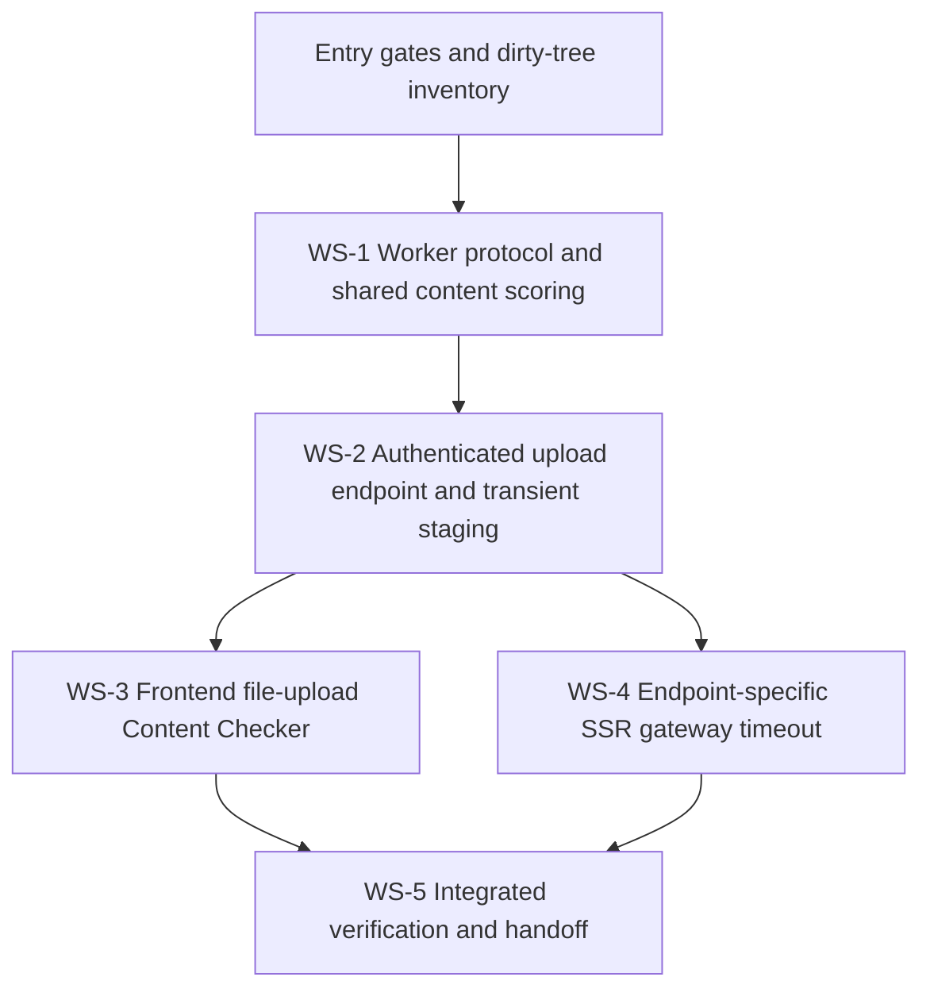

# Upload-based Content Checker Implementation Plan

## Status

- **Planning status:** Ready for implementation after the entry gates below are satisfied.
- **Architecture status:** Frozen; this plan does not reopen endpoint, storage, extraction, scoring, or UI decisions.
- **Implementation status:** Not started by the Planning Agent.
- **Repository condition:** Treat the shared worktree as heavily dirty. Do not reset, clean, checkout, stash, or overwrite pre-existing changes.
- **Standing execution constraint:** No worktree, commit, push, or PR operation may occur unless that constraint is explicitly lifted. The active execution path is therefore sequential work in the current worktree. The isolated-worktree topology below is contingency guidance only.

## Objective

Replace the researcher Content Checker's typed-keyword input with a transient PDF/DOCX upload flow while leaving the Title Checker unchanged. The upload must be authenticated, bounded to 25 MiB, privately staged only for extraction, never persisted, cleaned in `finally`, extracted through `ManuscriptTextExtractor` without OCR, and scored against the same eligible public archived manuscript content and response resource already used by `PublicRepositorySimilarityService`.

The resulting contract is:

```text
POST /api/similarity/content-upload
Content-Type: multipart/form-data
field: file
authentication: active account
accepted files: PDF or DOCX, maximum 25 MiB
success: { "data": PublicRepositorySimilarityResource[] }
unreadable/no-text/scanned/corrupt: 422 { "error": "CONTENT_UPLOAD_UNREADABLE" }
```

## Frozen Scope and Decisions

1. Add `POST /api/similarity/content-upload`; keep it inside the existing `current.user` + `account.active` route group and require `origin.allowed`.
2. Accept exactly one multipart field named `file`. Reject missing, additional, non-file, non-PDF/DOCX, and files larger than 25 MiB. Laravel remains authoritative even if the browser performs early validation.
3. Preserve `POST /api/similarity/query` and its exact JSON `{q}` contract with the existing 2–200 character bound. Retain `/api/similarity/content-query` as a compatibility endpoint, but remove all use of it from the Content Checker UI.
4. Stage the accepted upload at a randomized path under `backend/storage/app/private/similarity-content-upload/<random>/upload.{pdf|docx}`. Do not use the client filename as a path component. Use restrictive directory/file permissions where supported.
5. Invoke `ManuscriptTextExtractor::extract()` on the canonical staged path. Do not add OCR, image conversion, alternate parsers, or direct extraction logic to the endpoint.
6. Wrap staging, extraction, and scoring in `try/finally`; unlink the file and remove its request directory on success, extraction failure, worker failure, and response-mapping failure. Never return or log the staged path or parser detail.
7. Convert `ManuscriptTextExtractionException`, empty/no-text extraction, malformed/scanned PDF, and corrupt DOCX outcomes to the single sanitized response `422 CONTENT_UPLOAD_UNREADABLE`. The UI may explain that scanned/image-only PDFs are unsupported, but it must not expose parser output.
8. Add a distinct worker payload with exact keys `{uploaded_content, candidates}`. `uploaded_content` is non-empty text up to `SIMILARITY_MAXIMUM_CONTENT_CHARACTERS` (default and acceptance boundary: 1,000,000 characters). The existing `{query, candidates}` protocol remains capped at 200 characters.
9. Add `SimilarityProcessRunner::runUploadedContentQuery()` and a corresponding `PublicRepositorySimilarityService::compareUploadedContent()` path. Refactor only enough to share the existing content-only candidate selection (maximum 250), trusted-ready candidate projection handling, standalone content score policy, zero-score filtering, ordering, and `PublicRepositorySimilarityResource` mapping.
10. Do not create a `ResearchDocument`, `DocumentFile`, search projection, similarity result, notification, or audit entry. Add no migration, queue job, cache, object-storage write, or durable file record.
11. Add a dedicated `similarity-content-upload` limiter with all four limits for every role: 2/minute and 20/hour per user, plus 10/minute and 60/hour per trusted client IP. Upload parsing is resource-intensive, so no role receives a bypass.
12. The SSR gateway needs a route-specific timeout because its default API timeout can be shorter than extraction plus similarity processing. Use `SSR_CONTENT_UPLOAD_TIMEOUT_MS`, default 120,000 ms, only for `POST /api/similarity/content-upload`; keep `SSR_API_TIMEOUT_MS` at 5,000 ms for other API traffic. Keep the existing 27 MiB transport ceiling, which allows multipart overhead around a 25 MiB file.
13. In content mode, present a single-file upload control with PDF/DOCX accept hints, selected filename, 25 MiB guidance, no-OCR guidance, transient-file guidance, busy/disabled state, retryable errors, and the existing content-result table. Title mode's input, 200-character validation, endpoint, labels, and behavior remain unchanged.
14. No database or response-resource schema change is required.

## Repository Findings Driving the Plan

- Authenticated similarity routes are in `backend/routes/web.php`, not `routes/api.php`.
- `ManuscriptTextExtractor` already enforces the 25 MiB extraction input bound, normalized text, private-path process execution, a 1,000,000-character default, bounded output, and sanitized extraction exceptions.
- `PublicRepositorySimilarityService::compareContent()` already owns the content-only 250-candidate selection, filtering, score projection, and resource-ready shape.
- `SimilarityProcessRunner` and `similarity/cli.py` currently distinguish document and `{query,candidates}` protocols; the latter validates `query` at 200 characters.
- The Content Checker currently calls `/api/similarity/content-query` from `RoleSidebarPages.tsx`; Title Checker calls `/api/similarity/query` from the same component.
- `frontend/server.mjs` is the browser API gateway. It enforces a 27 MiB non-JSON body ceiling but currently applies one timeout to every API request.

## Entry Gates

All gates are mandatory before product-code editing starts.

1. **Constraint gate:** Confirm whether implementation is authorized. Until then, this document is planning-only and no product file is changed.
2. **Dirty-tree inventory:** Record `git status --short`, `git diff --name-only`, and a diff of every file assigned below. Do not modify or remove unrelated changes.
3. **Owned-file gate:** If an assigned existing file already has unreviewed edits, stop that workstream and have the repository owner identify the intended baseline. Do not silently merge by overwriting.
4. **Runtime gate:** Confirm PHP 8.3+, Composer dependencies, Python test dependencies, Node 22+, and npm dependencies are installed.
5. **Upload-runtime gate:** Confirm deployed PHP `upload_max_filesize` is at least 25 MiB and `post_max_size` is at least 27 MiB; otherwise the framework cannot enforce the intended file contract reliably.
6. **Private-storage gate:** Confirm `backend/storage/app/private` is writable by Laravel and is not web served.
7. **Baseline gate:** Run the focused existing title-query, similarity worker, Content Checker, API client, and gateway tests before editing. Record failures as pre-existing; do not broaden this feature to repair unrelated failures.

## Dependency Graph



| ID | Owner | Depends on | Can run in parallel | Exit gate |
|---|---|---|---|---|
| WS-1 | Backend Similarity Owner | G0 | No | Both worker protocols have strict independent length validation; shared content-only scoring tests pass. |
| WS-2 | Backend Upload API Owner | WS-1 | No | Endpoint contract, auth, validation, staging cleanup, no-persistence, error, eligibility, and throttle tests pass. |
| WS-3 | Frontend Checker Owner | WS-2 | WS-4 only in isolated worktrees | Content mode uploads `file`; title-mode regression tests and frontend checks pass. |
| WS-4 | Gateway Owner | WS-2 contract | WS-3 only in isolated worktrees | Only the upload endpoint receives the longer proxy/request timeout; gateway tests pass. |
| WS-5 | Verification Owner | WS-3, WS-4 | No | Full focused and repository suites pass or have documented unrelated baseline failures; no temp or persistence residue exists. |

## Exact File Ownership

Ownership is exclusive for this feature. An owner must not edit an unlisted file; a needed cross-owner change is returned to that file's owner.

### Planning Owner (closed after this plan)

- `docs/plans/upload-based-content-checker-implementation-plan.md`

### WS-1 — Backend Similarity Owner

- `backend/app/Services/similarity/cli.py`
- `backend/app/Services/SimilarityProcessRunner.php`
- `backend/app/Services/PublicRepositorySimilarityService.php`
- `backend/tests/Fixtures/similarity_worker.php`
- `backend/app/Services/similarity/tests/test_engine.py`
- `backend/tests/Unit/UploadedContentSimilarityProtocolTest.php` (new)

### WS-2 — Backend Upload API Owner

- `backend/app/Http/Requests/ContentUploadSimilarityRequest.php` (new)
- `backend/app/Services/UploadedContentSimilarityService.php` (new)
- `backend/app/Http/Controllers/SimilarityController.php`
- `backend/routes/web.php`
- `backend/app/Providers/AppServiceProvider.php`
- `backend/tests/Feature/ContentUploadSimilarityTest.php` (new)

### WS-3 — Frontend Checker Owner

- `frontend/src/api.ts`
- `frontend/src/api.test.ts`
- `frontend/src/RoleSidebarPages.tsx`
- `frontend/src/SimilarityQuery.test.tsx`
- `frontend/src/styles.css`

### WS-4 — Gateway Owner

- `frontend/server.mjs`
- `frontend/server.test.mjs`
- `frontend/.env.example`
- `README.md`

### WS-5 — Verification Owner

- No source-file ownership. Report failures to the owning workstream; do not make opportunistic fixes.

## Worktree and Shared-Tree Execution Controls

### Active mode: sequential current worktree

Because the standing constraint disallows worktrees and the shared tree is heavily dirty, use one owner at a time in this exact order:

1. WS-1
2. WS-2
3. WS-4
4. WS-3
5. WS-5

All four implementation workstreams are safe to execute **sequentially** in the current worktree because their file ownership does not overlap. WS-3 and WS-4 are logically parallel after WS-2, but must not run concurrently in a shared dirty worktree. Before each handoff, re-run `git status --short` and review diffs only; do not stage, commit, stash, reset, clean, or check out files while the standing constraint remains.

### Contingency mode: isolated worktrees only if explicitly authorized

Do not create these now. If the worktree prohibition is lifted, first establish a clean integration baseline that contains every required pre-existing dirty change, then use sibling paths so uncommitted shared-tree state is never lost:

| Workstream | Suggested branch | Suggested isolated path |
|---|---|---|
| WS-1 | `feature/content-upload-worker` | `D:\ResearchNav\wt-content-upload-worker` |
| WS-2 | `feature/content-upload-api` | `D:\ResearchNav\wt-content-upload-api` |
| WS-3 | `feature/content-upload-ui` | `D:\ResearchNav\wt-content-upload-ui` |
| WS-4 | `feature/content-upload-gateway` | `D:\ResearchNav\wt-content-upload-gateway` |
| Integration | `feature/content-upload-integration` | `D:\ResearchNav\wt-content-upload-integration` |

WS-2 must start from integrated WS-1. WS-3 and WS-4 must start from integrated WS-2 and may then proceed in parallel. Only the Integration owner combines completed work. Never create a worktree directly from a baseline that omits needed uncommitted shared-tree changes.

## Executable Tasks

### WS-1 — Worker Protocol and Shared Content Scoring

**Implementation steps**

1. Add strict CLI recognition for exact `{uploaded_content,candidates}` payloads.
2. Validate `uploaded_content` as a non-empty string no longer than `MAX_CONTENT_LENGTH`; retain exact `{query,candidates}` validation at 2–200 characters.
3. Reuse `compare_query()` for uploaded text versus trusted candidate content; do not add a new scoring algorithm or title weighting.
4. Add `SimilarityProcessRunner::runUploadedContentQuery(string, Collection)`. Share the existing standalone content result normalization so content and uploaded-content paths cannot diverge in score/classification/ranking behavior.
5. Add `PublicRepositorySimilarityService::compareUploadedContent(string)` using the same 250-candidate eligibility, trusted-ready content, zero filtering, and resource-ready field projection as `compareContent()`.
6. Update the PHP fixture to understand `uploaded_content` without weakening exact payload-shape checks.

**Acceptance checks**

- A 200-character `query` is accepted and 201 is rejected by the worker.
- A 1,000,000-character `uploaded_content` value is accepted and 1,000,001 is rejected under default configuration.
- Extra keys, missing keys, non-string uploaded content, duplicate candidate IDs, and over-cap candidate lists produce only `INVALID_INPUT` with exit code 2.
- Uploaded content uses content-only standalone policy and ordering; title scores do not influence its rank.
- Candidates lacking a trusted ready manuscript projection remain content-unavailable and are not fabricated as zero-scored matches.
- Worker environment sanitization, maximum input/output bytes, and typed-title behavior remain unchanged.

**Focused tests**

```powershell
python -m pytest backend/app/Services/similarity/tests/test_engine.py
python -m ruff check backend/app/Services/similarity/cli.py backend/app/Services/similarity/tests/test_engine.py
php backend/artisan test --filter=UploadedContentSimilarityProtocolTest
php backend/artisan test --filter=SimilarityQueryTest
```

**Exit gate:** All checks above pass, and the WS-1 diff contains no endpoint, route, UI, gateway, migration, or persistence changes.

### WS-2 — Authenticated Endpoint, Private Staging, and Throttle

**Implementation steps**

1. Create `ContentUploadSimilarityRequest` with `authorize(): true`, multipart enforcement, exact field-set validation, and `file` rules equivalent to `bail|required|file|max:25600|mimes:pdf,docx|extensions:pdf,docx`.
2. Create `UploadedContentSimilarityService` that:
   - maps only the validated `pdf`/`docx` extension;
   - creates a random per-request directory below private storage;
   - moves/copies the upload to `upload.<extension>` without retaining the client filename;
   - resolves and verifies the canonical path remains inside the private staging root;
   - extracts through `ManuscriptTextExtractor`;
   - rejects empty extracted text as unreadable;
   - calls `PublicRepositorySimilarityService::compareUploadedContent()`;
   - removes the staged file and request directory in `finally`.
3. Add `SimilarityController::contentUpload()`, return `PublicRepositorySimilarityResource::collection(...)`, map extraction/unreadable failures to exact `422 CONTENT_UPLOAD_UNREADABLE`, and preserve existing generic similarity capacity/catalog/unavailable/process error handling without exposing exception messages.
4. Register `POST similarity/content-upload` under active-account middleware with `origin.allowed` and `throttle:similarity-content-upload`.
5. Register the dedicated limiter with 2/minute + 20/hour per user and 10/minute + 60/hour per trusted IP for every role, without a privileged bypass.

**Acceptance checks**

- Anonymous returns 401; inactive/blocked returns the existing 403 account error; each active supported role can call the endpoint.
- Missing origin fails with the existing sanitized origin error before work starts.
- The route accepts one valid PDF or DOCX at exactly 25 MiB and rejects 25 MiB + 1 byte, wrong extensions/types, malformed multipart, missing `file`, multiple `file` values, and additional fields.
- The extractor receives a canonical path under private staging with a randomized directory and safe extension; the original filename never becomes part of the path or response.
- A scanned/image-only PDF, empty extraction, corrupt document, and extractor exception all return exactly `422 {"error":"CONTENT_UPLOAD_UNREADABLE"}` without paths, parser messages, stack traces, or uploaded content.
- The staged file and per-request directory are absent after success, unreadable extraction, similarity worker exception, and response failure.
- Only archived + archived + public + non-deleted candidates are returned, using the existing content-only score/resource shape; private, registered-only, draft, deleted, and untrusted/stale-content candidates are excluded or content-unavailable as currently defined.
- `similarity_results`, `notifications`, `audit_logs`, `research_documents`, `document_files`, and `manuscript_search_documents` receive no new rows or updates.
- A normal user is throttled on the third request in one minute and the twenty-first in one hour; the limiter is independent from title-query counters.
- `/api/similarity/query` still accepts only JSON `{q}` up to 200 characters. `/api/similarity/content-query` remains compatible but is no longer the UI path.

**Focused tests**

```powershell
php backend/artisan route:list --path=api/similarity/content-upload
php backend/artisan test --filter=ContentUploadSimilarityTest
php backend/artisan test --filter=SimilarityQueryTest
php backend/artisan test --filter=PublicRepositorySimilarityTest
backend\vendor\bin\pint --test backend/app/Http/Requests/ContentUploadSimilarityRequest.php backend/app/Services/UploadedContentSimilarityService.php backend/app/Http/Controllers/SimilarityController.php backend/routes/web.php backend/app/Providers/AppServiceProvider.php backend/tests/Feature/ContentUploadSimilarityTest.php
```

**Exit gate:** Endpoint and cleanup tests pass repeatedly, route middleware is correct, and there is no migration, durable upload, model write, OCR, or response-schema change.

### WS-3 — Frontend Content Upload Mode

**Implementation steps**

1. Replace `checkContentQuerySimilarity(q)` with `checkContentUploadSimilarity(file)`, constructing `FormData`, appending exactly `file`, and allowing `apiRequest` to set no manual multipart `Content-Type` header.
2. Keep all title-mode state, text input, 200-character count, validation, endpoint, and result presentation unchanged.
3. In content mode render one accessible file input with PDF/DOCX accept values, selected filename, 25 MiB limit text, no-OCR/scanned-PDF warning, and “not retained” text.
4. Disable submission until one client-valid file is selected and while checking. Client-side extension/type and size checks are usability only; surface server validation as authoritative.
5. Submit the selected `File` to `/api/similarity/content-upload`, retain the existing server-ranked content results, and identify the result heading by the selected filename rather than extracted content.
6. Map `CONTENT_UPLOAD_UNREADABLE` to a safe actionable message. Map 413/validation to file type/size guidance, 429 to wait/retry guidance, and worker failures to the existing no-score message.
7. Reset content selection/results when switching modes; never read file text in the browser and never place it in component state, logs, URL, or SSR state.

**Acceptance checks**

- Title Checker regression tests prove the request remains `/api/similarity/query` with exact JSON `{q}` and unchanged labels/validation.
- Content mode has no keyword text field and sends exactly one multipart `file` to `/api/similarity/content-upload` with credentials included and no manually supplied `Content-Type`.
- PDF and DOCX selections enable checking; unsupported and over-25-MiB files show guidance and do not call fetch.
- Busy, retry, 422 unreadable, 413/validation, 429, 401, and 5xx states are accessible and sanitized.
- Existing content similarity rows, matched terms, metadata action, classification, review warning, empty state, and low-similarity disclaimer still render from the server response.
- No selected file bytes or extracted content are rendered or serialized.

**Focused tests**

```powershell
npm run test --workspace=@researchnav/frontend -- src/api.test.ts src/SimilarityQuery.test.tsx
npm run typecheck --workspace=@researchnav/frontend
npm run lint --workspace=@researchnav/frontend
npm run format:check --workspace=@researchnav/frontend
```

**Exit gate:** Content upload tests pass, title tests are unchanged in behavior, and no frontend code calls `/api/similarity/content-query`.

### WS-4 — Endpoint-specific SSR Gateway Timeout

**Implementation steps**

1. Parse `SSR_CONTENT_UPLOAD_TIMEOUT_MS` (default 120,000; bounded with the existing integer validation style).
2. For exact normalized `POST /api/similarity/content-upload`, apply the longer value to both `request.setTimeout()` and per-call proxy `timeout`/`proxyTimeout` options.
3. Use `SSR_API_TIMEOUT_MS` for every other API route. Do not globally lengthen health, JSON mutation, or SSR-render calls.
4. Preserve the existing content-length/transfer-encoding defenses and 27 MiB maximum body setting.
5. Document both timeout variables in `frontend/.env.example` and `README.md`; set the example global API timeout to 5,000 and the upload timeout to 120,000.

**Acceptance checks**

- A delayed upload response that exceeds the normal API timeout but completes inside the upload timeout is proxied successfully with method, multipart body, cookie, and origin intact.
- A delayed non-upload API request still times out on the normal limit.
- Trailing slash normalization is explicit and tested; other methods on the path do not gain the long timeout.
- A multipart body above the configured gateway ceiling is rejected before proxying; normal multipart upload bodies stream without buffering in application code.
- Upstream failures continue to return sanitized JSON `API_UPSTREAM_UNAVAILABLE`.

**Focused tests**

```powershell
npm run test --workspace=@researchnav/frontend -- server.test.mjs
npm run typecheck --workspace=@researchnav/frontend
npm run lint --workspace=@researchnav/frontend
npm run format:check --workspace=@researchnav/frontend
```

**Exit gate:** Route-specific timeout and regression tests pass, and the general API timeout has not been broadened.

### WS-5 — Integrated Verification

**Verification sequence**

```powershell
# Backend PHP
composer --working-dir=backend test

# Similarity/extraction Python
python -m pytest backend/app/Services/similarity/tests
python -m ruff check backend/app/Services/similarity
python -m mypy backend/app/Services/similarity

# Frontend and gateway
npm run test --workspace=@researchnav/frontend
npm run typecheck --workspace=@researchnav/frontend
npm run lint --workspace=@researchnav/frontend
npm run format:check --workspace=@researchnav/frontend
npm run build --workspace=@researchnav/frontend

# Route inspection
php backend/artisan route:list --path=api/similarity
```

**Manual smoke checks**

1. Sign in with an active researcher and confirm Title Checker behaves exactly as before.
2. Upload a text-bearing PDF and DOCX smaller than 25 MiB; confirm ranked public archived content matches render.
3. Upload an image-only PDF and a corrupt DOCX; confirm only the sanitized unreadable message appears.
4. Try wrong type and over-limit files; confirm no scoring starts.
5. Observe the private staging root during a deliberately slowed request, then after success and failure; confirm only the in-flight randomized file exists and no request directory remains afterward.
6. Confirm no new or updated rows in similarity results, notifications, audit logs, research documents, document files, or search projections.
7. Confirm private/registered/draft/deleted catalog records do not appear and no response includes paths, checksums, body text, internal submitter IDs, or parser diagnostics.
8. Through the SSR gateway, confirm an upload can outlive the normal 5-second API timeout while a non-upload request cannot.

## Global Exit Gates

- Frozen endpoint and multipart contract are met.
- Active-account, allowed-origin, dedicated-throttle, file type, size, protocol-length, candidate-eligibility, and resource-boundary tests pass.
- Success and every handled failure path remove private staged content in `finally`.
- No OCR and no durable persistence were introduced.
- Title Checker and typed `q` remain unchanged at the API and UI boundaries.
- The long gateway timeout applies only to the upload endpoint.
- Focused suites and full suites pass, or any unrelated pre-existing failure is documented with its unchanged baseline evidence.
- Final `git diff --check` is clean, and final review shows only files in the ownership map changed for this feature.
- Security review finds no uploaded text, client filename path usage, private path, parser detail, credentials, or candidate manuscript body in responses/logging.

## Risk Controls

| Risk | Control | Verification |
|---|---|---|
| Dirty shared worktree overwrites unrelated work | Sequential ownership, pre-task file diffs, no reset/clean/stash/checkout, stop on dirty owned files | Compare before/after `git status --short` and owned-file diffs |
| Filename traversal or private-path disclosure | Random server directory, fixed safe basename, extension whitelist, canonical-root check, no exception detail | Malicious filename feature tests and response assertions |
| Temp residue | `try/finally` around extraction and scoring; unique request directory | Success and injected-failure cleanup tests plus smoke inspection |
| PHP/gateway limits reject valid 25 MiB upload | PHP deployment gate; 27 MiB gateway envelope; exact 25 MiB boundary tests | Runtime config check and feature/gateway tests |
| MIME ambiguity for DOCX ZIP containers | Require `.docx` extension and Laravel file validation, then rely on bounded DOCX parser validation | Valid DOCX and renamed/corrupt ZIP tests |
| Scanned PDF triggers accidental OCR or leaks diagnostics | Existing extractor only; catch generic extraction exception; one sanitized API code | Image-only PDF test and exact JSON assertion |
| Worker protocol confuses large upload with typed query | Exact disjoint key sets and separate limits | 200/201 and 1,000,000/1,000,001 boundary tests |
| CPU/memory exhaustion from 1M text × catalog | Existing 250 content-candidate cap, worker I/O/time/memory controls, stricter user/IP throttle | Capacity, timeout, and 429 tests; observe test resource use |
| Gateway times out before extraction/scoring | Exact endpoint-specific 120-second timeout | Delayed upstream gateway test |
| Long timeout leaks to unrelated APIs | Per-request proxy options and exact method/path match | Delayed non-upload regression test |
| Persistence side effects | Reuse read-only public similarity service; no model/storage write API | Database count/update assertions and private directory checks |
| Response exposes private candidate data | Reuse `PublicRepositorySimilarityResource` | Exact deny-list assertions for paths/body/checksums/private IDs |
| Process termination bypasses PHP `finally` | Keep staging private, randomized, and request-scoped; operationally monitor the staging root | Deployment runbook check; do not claim hard-kill cleanup as guaranteed |

## Workstream Checklist

- [ ] G0 constraints and dirty-tree inventory recorded
- [ ] Runtime, PHP upload, private-storage, and baseline test gates passed
- [ ] WS-1 exact `uploaded_content` protocol implemented
- [ ] WS-1 query/upload boundary and malformed-protocol tests passed
- [ ] WS-1 shared content-only scoring and eligibility reuse verified
- [ ] WS-2 multipart request and route middleware implemented
- [ ] WS-2 private randomized staging and canonical-root checks implemented
- [ ] WS-2 `finally` cleanup proven on success and injected failures
- [ ] WS-2 sanitized unreadable/no-OCR response proven
- [ ] WS-2 no-persistence assertions passed
- [ ] WS-2 dedicated user/IP throttle assertions passed
- [ ] WS-3 content file picker and multipart client implemented
- [ ] WS-3 invalid/oversize/unreadable/error UX tested
- [ ] WS-3 Title Checker regression suite passed unchanged
- [ ] WS-4 exact endpoint-specific timeout implemented and documented
- [ ] WS-4 normal-timeout and body-limit regressions passed
- [ ] WS-5 focused PHP/Python/frontend/gateway checks passed
- [ ] WS-5 full test, lint, typecheck, format-check, and build checks passed
- [ ] Final private-data, no-persistence, and temp-cleanup review passed
- [ ] Final diff is limited to the ownership map and contains no unrelated cleanup

## Plan PR Body Draft

> **Title:** Plan: upload-based authenticated Content Checker
>
> ## Summary
> Defines the dependency-ordered implementation plan for replacing the researcher Content Checker's typed keyword flow with transient PDF/DOCX upload scoring. The plan preserves the Title Checker, reuses existing manuscript extraction and public content-only similarity behavior, adds a strict `uploaded_content` worker protocol, and introduces no durable persistence.
>
> ## Frozen contract
> - `POST /api/similarity/content-upload`, multipart field `file`
> - active authenticated accounts and allowed origin
> - PDF/DOCX only, maximum 25 MiB, no OCR
> - private randomized temp staging with `finally` cleanup
> - extraction through `ManuscriptTextExtractor`
> - separate worker `uploaded_content` input capped at 1,000,000 characters; typed `q` remains 200
> - existing public archived content-only eligibility/scoring/resource
> - no database, cache, object-storage, audit, notification, or file persistence
> - dedicated stricter user/IP throttle
> - sanitized `CONTENT_UPLOAD_UNREADABLE`
> - endpoint-specific SSR gateway timeout
> - file upload in Content Checker; Title Checker unchanged
>
> ## Execution
> WS-1 worker/scoring → WS-2 backend upload endpoint → WS-3 UI and WS-4 gateway → WS-5 integrated verification. File ownership is exclusive. Because the shared worktree is heavily dirty and worktrees are currently prohibited, implementation is sequential and must preserve all pre-existing changes.
>
> ## Verification
> Includes PHP feature/unit tests, Python protocol tests, Vitest UI/API/gateway tests, route inspection, lint/typecheck/format/build checks, temp-cleanup checks, database no-write assertions, and manual PDF/DOCX/image-only smoke tests.
>
> ## Risk controls
> Guards cover dirty-tree collisions, path traversal, MIME ambiguity, scanned documents, protocol confusion, resource exhaustion, gateway timeout scope, cleanup failures, and private-data leakage.
>
> ## Checklist
> - [ ] Architecture and API contract approved
> - [ ] File ownership and dependency graph approved
> - [ ] Runtime/upload limit gates approved
> - [ ] Security and no-persistence acceptance checks approved
> - [ ] Test matrix approved
> - [ ] Standing execution constraint explicitly resolved before implementation

## Remaining Work

Implementation has not begun. The repository owner must first resolve the entry gates, especially authorization to edit and the baseline of any dirty owned files. Then execute WS-1 through WS-5 in dependency order without broad cleanup or unrelated refactoring.
